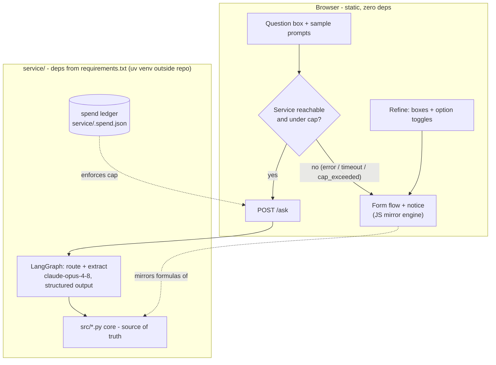

# feat: Question-first UI, LangGraph agent backend, option combos, and layered verification

## Summary

Rebuild the web UI around a single natural-language question box (default: the community-solar / $150-bill question) routed by a local LangGraph + Claude service, with automatic fallback to the existing form flow. Replace the option dropdown with toggle buttons that add two new combined models (battery+rooftop, battery+balcony). Deepen assumption explanations (short summary shown, plain-English detail and source explanation on expand). Extend verification to the avird_2026 two-layer model: a deterministic browser gate plus an agent-driven perception loop with judged, recorded evidence.

---

## Problem Frame

The current UI front-loads mechanism (a dropdown of option types, input boxes) when the user's real entry point is a question. The four options can't be combined even though battery pairings are the realistic purchase decisions. Assumption summaries are good but assume familiarity ("Share of your usage the subscription is sized to cover" means nothing to a community-solar newcomer), and sources are links without explanation. Finally, "the website works" is currently proven only by a deterministic DOM check that doesn't run on this Windows machine (Linux-only browser discovery) and can't judge whether the page *reads* right.

Environment note. The prototype's "stdlib-only, no installed packages" rule is retired — it was a yolo-mode prototype constraint, not a product decision, and this plan is not bound by it or by other prototype-era conventions. Going forward: dependencies are managed with **uv**, in a venv created **outside the repo**, with a checked-in `requirements.txt`; **pytest** is the test runner (it collects the existing `unittest`-style tests as-is, so nothing needs migrating up front).

---

## Requirements

**Question-first UI**

- R1. The landing view is a single question box, default text "What savings would I get with community solar when my bill is $150 a month?", with a few clickable sample prompts. No option dropdown, no option buttons across the top.
- R2. With no user input, the page shows the community-solar estimate for an average Maine monthly bill — a new `default_monthly_bill` assumption, sourced if research has landed a number, otherwise tagged `unsourced - pending research`.
- R3. A "refine" control opens the input boxes and option toggles; running a refine rewrites the headline statement at the top into a plain-sentence description of the refined scenario. The refine path is fully client-side (works with the backend down).
- R4. Option toggles permit exactly these states: community, battery, rooftop, balcony, battery+balcony, battery+rooftop. Community is exclusive; rooftop+balcony is not offered.
- R5. After any result, a follow-up prompt invites the information that would most tighten the estimate (e.g. annual kWh, roof size).

**Agent routing**

- R6. Natural-language questions are routed by a LangGraph agent (Claude API) that picks the option(s), extracts numeric inputs, runs the Python core, and returns the same structured payload shape the CLI `--json` emits. Extracted values are tagged `user-provided` (extraction is not a source).
- R7. When the service is unreachable, times out, or reports the spending cap reached, the frontend falls back automatically to the form flow with a visible notice. The form flow is fully functional with zero backend.
- R8. The spending cap is enforced server-side from per-response `usage` token counts, persisted across restarts.

**Combined options**

- R9. battery+rooftop and battery+balcony are modeled additively — each component keeps its own escalation/degradation/horizon stream — with full `Step` chains showing how the components combine. Interaction assumptions (e.g. battery uplift to rooftop self-consumption value) default to zero and are tagged `unsourced - pending research`.
- R10. Combos are available in the CLI (`--option battery+rooftop`, `--json` parity) and in the web mirror with their own parity self-check entries.

**Assumption explanations**

- R11. Every assumption keeps its short label and gains a deeper plain-English explanation shown on hover/expand — written for someone new to the option (what the number means, why it matters, what moves it).
- R12. The expanded view explains what the source *is* (what kind of document, who publishes it, why it's trustworthy), not just a title and link.

**Verification**

- R13. The deterministic browser loop (`tools/verify_web.py`) discovers a browser on any OS (Linux, Windows, macOS — currently Linux-only) and covers all six option states plus question-box and fallback-notice markers.
- R14. An avird_2026-style agent perception loop exists: Claude drives the playwright plugin's MCP browser tools (navigate → a11y snapshot → screenshot → console check), judges the page against stated intent, and records verdicts as evidence in `.verify/`. The Stop-hook gate stays deterministic and token-free — it reads artifacts, never drives a browser or calls a model.

**Conventions preserved**

- R15. The Python calculation core remains the source of truth. Dependencies live in a single checked-in `requirements.txt`, installed into a uv venv created outside the repo; pytest is the test runner. Agent-native parity holds: everything the question box does is doable headlessly via the service API or `--json`.

---

## Key Technical Decisions

- **One environment, managed by uv.** A single uv venv created outside the repo (e.g. `uv venv %USERPROFILE%\.venvs\solar-calc`), with a checked-in `requirements.txt` at the repo root covering the service deps and dev tooling (pytest). Tests run with `pytest` — existing `unittest`-style tests are collected as-is; new tests may be written pytest-style. The LangGraph service still lives in `service/` as its own module, but there is no stdlib-only boundary to police. The static form flow needs no backend or Python at all in the browser, which is exactly why it can be the fallback (R7).
- **The agent calls the Python core, not the JS mirror.** `service/` imports `src/` directly and returns payloads in the existing CLI `--json` schema. Agent-path numbers therefore come from the source of truth by construction; the JS mirror remains only behind the client-side refine path with its existing on-load parity self-check.
- **Model and extraction shape.** `claude-opus-4-8` via the Anthropic API, using structured output / tool-calling for `{options: [...], inputs: {...}, unanswerable: bool}` extraction. One routing+extraction call per question — the "graph" is small (route → extract → compute → respond); if the current LangGraph API makes a single tool-calling node simpler than a multi-node graph, the implementer may collapse it (see Open Questions — LangGraph's current API surface was not externally verified at plan time).
- **Spending cap mechanics.** The service accumulates cost from `response.usage` (input/output tokens × the model's per-MTok prices) into a gitignored ledger file (e.g. `service/.spend.json`). Over cap → the `/ask` endpoint returns a structured `cap_exceeded` error; frontend treats it like service-down and falls back. Cap value configurable via env var with a small default (e.g. $5).
- **Fallback detection is client-side and dumb.** `fetch` to `http://localhost:<port>/ask` with a short timeout (~4s); any network error, non-OK status, or `cap_exceeded` body → render the form flow plus notice. No health-check polling loop.
- **Combos are stream-wise additive.** A pure combining helper in `src/capital.py` takes the component options' yearly cashflow streams (each computed with its own escalation/degradation/horizon — battery keeps 10 years, PV keeps 25), sums per-year cashflows over the longer horizon, and derives combined NPV, payback, and verdict from the summed stream. NPV is additive; payback must come from the combined stream, not from adding paybacks. This resolves the horizon mismatch found in research without touching `compare()`'s single-stream contract.
- **Toggle state machine replaces the dropdown.** Four toggle buttons; selection rules enforce R4's six valid states. `selectOption(key)` stays a global function (the verifier's driver shim depends on it) and gains the two combo keys.
- **Explanations are a data-model extension, not UI-only.** `Assumption` gains an `explain` field (plain-English depth) and `Source` gains a `what_is_it` field (what the document is / why trustworthy). Both flow to CLI `--json`, CLI text render, and the JS mirror — agent-native parity means the explanation text is not trapped in HTML.
- **Judge is evidence, gate stays deterministic.** The perception loop and any LLM judgment write verdicts into `.verify/` during evidence *production*; `verify_web.py check` and the Stop hook keep reading artifacts only. A recorded failing verdict blocks like any failing evidence: record fail → fix → re-run → record pass (avird convention: the fail record is history, not embarrassment).
- **UI redesign executes with the frontend-design plugin** (confirmed by user), keeping the existing "Maine Solar Ledger" almanac identity unless the design pass argues otherwise.

---

## High-Level Technical Design

### System shape

### Toggle state machine (R4)

Valid states: `community` | `battery` | `rooftop` | `balcony` | `battery+rooftop` | `battery+balcony`. Rules: selecting **community** clears everything else; selecting **rooftop** or **balcony** clears community and the other PV option; **battery** may coexist with rooftop or balcony but not community; a PV toggle added to battery forms the combo. Deselecting down to zero re-selects community (the default).

### Verification layers (R13, R14)

| Layer | Tooling | Sees | Verdict | When |
|---|---|---|---|---|
| Deterministic loop | `tools/verify_web.py run` (headless Chrome/Edge) | DOM markers, parity banner, JS errors, screenshots | Hard pass/fail in `evidence.json` | Every `web/` change |
| Agent perception loop | `/verify-page`-style command over playwright plugin MCP tools | Layout, a11y tree, console, visual judgment vs intent | Judged punch list recorded to `.verify/` | While building UI; before ending web turns |
| Gate | `verify_web.py check` + Stop hook | Artifacts + content hashes only | Exit 0/3 — token-free | End of turn |

---

## Implementation Units

### U1. Combined-option models: battery+rooftop and battery+balcony

- **Goal:** Pure-Python combined models with honest step chains and additive stream economics.
- **Requirements:** R9, R10 (CLI half), R15
- **Dependencies:** none
- **Files:** `src/capital.py` (stream-combining helper), `src/combo.py` (or `src/battery_rooftop.py` + `src/battery_balcony.py` — implementer's call; one mechanism, two thin configurations), `src/assumptions.py` (combo builders + interaction assumptions), `src/cli.py` (`battery+rooftop`, `battery+balcony` in `CAPITAL_OPTIONS`), `tests/test_combo.py`
- **Approach:** Each combo computes its components via the existing option modules, then combines: upfronts sum; yearly cashflow streams (battery at horizon 10 / no escalation, PV at horizon 25 / 3% escalation / 0.5% degradation) sum per-year over 25 years; NPV/payback/verdict derive from the summed stream. Assumption merge follows the battery precedent (merge order documented; key collisions like `federal_itc_pct` resolved per-component, not shared). New interaction assumption per combo (e.g. `battery_pv_interaction_value_per_year`), default 0.0, tagged `UNSOURCED`, source note pointing at `docs/options-integration-notes.md`'s open "battery+rooftop pairing economics" item.
- **Patterns to follow:** per-option module template (module docstring with numbered chain, frozen result dataclass carrying `steps` and `capital`, `compute()` + `compute_from_assumptions()`, `ValueError` guards); `Step.uses` naming assumption keys.
- **Test scenarios:**
  - Happy path: hand-verified worked example per combo with `escalation=0, degradation=0` — assert upfront = sum of component upfronts, year-1 savings = sum of component year-1 savings, NPV equals the sum of component NPVs under identical rates, payback computed from the combined stream (construct an example where combined payback ≠ either component's), step count and `uses` keys.
  - Horizon honesty: battery cashflows contribute nothing after year 10 while PV continues to 25 — assert year-11 combined cashflow equals the PV-only cashflow.
  - Interaction assumption: default 0 leaves combined result exactly additive; setting it non-zero shifts annual savings by that amount; tag test asserts it is `UNSOURCED` with no URL.
  - Guards: negative capacity, zero horizon raise `ValueError`; `compute_from_assumptions` round-trips the builder defaults.
  - CLI: `--option battery+rooftop --json` emits the standard schema with combo steps; `--set` re-tags an overridden assumption `user-provided`.
- **Verification:** `pytest tests` green; CLI renders both combos with step chains.

### U2. Assumption explanation depth

- **Goal:** Every assumption carries a newcomer-grade explanation; every source explains what it is.
- **Requirements:** R11, R12, R15
- **Dependencies:** U1 (so combo assumptions get explanations in one pass)
- **Files:** `src/assumptions.py` (`Assumption.explain`, `Source.what_is_it`), `src/cli.py` (render + JSON), `tests/test_assumptions_explanations.py`, plus prose for every existing assumption across all option builders
- **Approach:** Add optional-with-default fields so construction sites don't all break at once, then fill them in for every assumption. `explain` answers: what is this number, why does it matter to *your* savings, what makes it bigger or smaller. `what_is_it` answers: what kind of document the source is and why it's credible (e.g. "the utility's own tariff sheet filed with the Maine PUC — the legally binding price"). The offset-fraction assumption named by the user is the quality bar: a community-solar newcomer should understand it from the expanded text alone. JSON schema adds both fields; `with_user_value()` preserves `explain` while still clearing the source.
- **Test scenarios:**
  - Every assumption in every builder has a non-empty `explain` (loop over all builders — this is the completeness gate).
  - Every `DEFAULT_SOURCED` assumption's source has non-empty `what_is_it`.
  - `with_user_value()` keeps `explain`, clears source.
  - `--json` output includes `explain` and `source.what_is_it`.
- **Verification:** unit suite green; spot-read the offset-fraction explanation for newcomer clarity.

### U3. Cross-platform browser discovery for the deterministic verifier

- **Goal:** `tools/verify_web.py` finds a browser on any OS (it currently only knows Linux locations), so web work in U4+ is actually gated on whatever machine runs it — including this Windows one.
- **Requirements:** R13 (discovery half), R15
- **Dependencies:** none (do before any `web/` edits)
- **Files:** `tools/verify_web.py` (`find_chromium()`), `tests/test_verify_web.py`
- **Approach:** Make discovery OS-general: `shutil.which` for the common binary names first (`chrome`, `google-chrome`, `chromium`, `msedge`), then per-OS well-known paths — keep the existing Linux list, add Windows (`chrome.exe`/`msedge.exe` under both Program Files roots) and macOS (`/Applications/Google Chrome.app/...`) candidates. Verify headless flags (`--headless --dump-dom`, `--screenshot`) behave on the binary actually discovered here; if flag behavior differs by browser/version, branch on capability, not on OS. Run the full loop once against the current site to produce fresh passing evidence.
- **Test scenarios:**
  - `find_chromium()` returns the right candidate per platform (monkeypatch `shutil.which` / path probes to simulate Linux-only, Windows-only, and macOS-only machines).
  - Existing verifier unit tests still pass; `verify_web.py run` exits 0 on this machine and writes `evidence.json` with hashes matching `web/` files.
  - `Test expectation:` the run itself is the integration test — record its passing evidence.
- **Verification:** `python tools/verify_web.py run` then `check` both exit 0 on Windows.

### U4. Web UI redesign: question-first layout, refine toggles, explanations

- **Goal:** The new front page — question box with samples, no dropdown, refine view with combo toggles, rewritten headline statements, hover/expand explanations — fully working client-side (agent wiring arrives in U6).
- **Requirements:** R1, R2, R3, R4, R5, R10 (mirror half), R11/R12 (UI half)
- **Dependencies:** U1, U2, U3
- **Files:** `web/index.html`, `web/app.js`, `src/assumptions.py` + `web/app.js` (`default_monthly_bill` assumption, both sides), `tools/verify_web.py` (`OPTIONS` list + markers, `WEB_FILES` if files are added)
- **Approach:** Execute with the frontend-design skill, preserving the almanac identity. Structure: question box + sample prompts at top (until U6, submitting routes to a client-side notice + form fallback — the fallback path is built first and is the default); default render = community at `default_monthly_bill`; refine `
`-style view with the four toggles implementing the R4 state machine; running a refine composes the headline sentence from the selected state and inputs. Mirror the two combos in `web/app.js` `OPTIONS` with `verifyAll()` expected-value entries copied from U1's worked examples. Assumption rows keep label + value + tag pill; an expand affordance (native `
` per row, plus `title`/hover) reveals `explain` and the source's `what_is_it`. Keep `selectOption()` global and extend `tools/verify_web.py` `OPTIONS` to all six states with markers for the question box and fallback notice.
- **Execution note:** run the agent perception loop (U7's manual form: playwright plugin navigate/snapshot/screenshot/console) while iterating, and finish with passing deterministic evidence — the Stop hook enforces the latter.
- **Test scenarios:**
  - Parity: `verifyAll()` passes for all six options (combined worked examples match U1's Python results to the same tolerances).
  - Toggle machine: each R4 rule — community clears others; rooftop+balcony impossible; battery+rooftop reachable; deselect-to-zero restores community (assert via the deterministic driver where possible; otherwise via perception loop).
  - Default render: no interaction → community estimate at `default_monthly_bill`, tag visible per its sourcing state.
  - Headline rewrite: refine to battery+rooftop with an edited capacity → headline sentence names the combo and inputs.
  - Explanations: expanding an assumption row shows `explain` text and source `what_is_it`; unsourced rows keep the warning.
  - Deterministic loop: all six option states render with `.big`, `.step-label`, option-specific markers; no `self-check FAILED`; no JS errors in probe.
- **Verification:** `verify_web.py run` + `check` pass covering six states; perception-loop punch list clean.

### U5. LangGraph agent service

- **Goal:** A local service that turns a natural-language question into a routed, computed, structured answer — with a spending cap.
- **Requirements:** R5 (data), R6, R8, R15
- **Dependencies:** U1 (combos must be routable)
- **Files:** `requirements.txt` (repo root — service deps + pytest), `service/app.py` (HTTP surface), `service/agent.py` (graph: route + extract), `service/spend.py` (ledger), `service/tests/test_agent.py`, `service/tests/test_spend.py`, `.gitignore` (ledger), `service/README.md` (run instructions: create the uv venv outside the repo, `uv pip install -r requirements.txt`, `ANTHROPIC_API_KEY` setup)
- **Approach:** FastAPI (or the lightest equivalent the LangGraph docs recommend at implementation time) exposing `POST /ask {question}` → `{option, result, steps, yearly, assumptions, agent: {extracted, notes}}` reusing the CLI JSON schema, plus CORS for the static page origin. The graph: one structured-output call (`claude-opus-4-8`) producing `{options, inputs, unanswerable}`; compute via direct `src/` imports; a second cheap call only if a conversational summary sentence is wanted. Extracted inputs applied via `with_user_value()` so tags are honest. Spend ledger: per-response `usage` × price table accumulated to `service/.spend.json`; checked before each call; over cap → structured `cap_exceeded` response (checked *before* spending, so the cap is a ceiling not a target). Include the R5 follow-up: the response names which missing input would most tighten the estimate.
- **Execution note:** verify current LangGraph/langchain-anthropic package names and minimal-graph API against live docs before pinning — external docs research did not complete at plan time (see Open Questions).
- **Test scenarios (stub the LLM call; no network in tests):**
  - Routing: the default question routes to community with bill=150; "batteries with rooftop solar for a 8kW roof" routes to battery+rooftop with capacity 8.
  - Parity guard: for the canonical worked example question, the service's numeric result equals `src/solar_calc.py`'s output exactly (the agent path cannot diverge from the core).
  - Tagging: extracted bill=150 arrives tagged `user-provided`; untouched assumptions keep their tags.
  - Unanswerable: an off-topic question returns a structured "can't answer, use the form" response (frontend treats as fallback).
  - Spend ledger: accumulates across calls, persists across process restarts, blocks when cap reached, `cap_exceeded` shape correct; ledger file is gitignored.
  - Error paths: missing API key → clean startup error naming the fix; LLM timeout → structured error the frontend can fall back on.
- **Verification:** `pytest service/tests` green; manual smoke: service up, `curl` the default question, numbers match the CLI.

### U6. Frontend agent integration and fallback

- **Goal:** The question box actually asks the agent, and degrades exactly as R7 demands.
- **Requirements:** R6 (frontend half), R7, R5 (display)
- **Dependencies:** U4, U5
- **Files:** `web/app.js`, `web/index.html`, `tools/verify_web.py` (fallback-notice marker)
- **Approach:** On submit: `fetch` `/ask` with ~4s timeout (AbortController). Success → render from the service payload (headline sentence, steps, assumptions with tags/explanations — same renderer as the mirror path, fed different data). Failure/timeout/`cap_exceeded`/`unanswerable` → form flow + notice ("calculator agent unavailable — using the classic form" / "agent budget used up for now"). Sample prompts fill the box and submit. After a result, render the follow-up refine prompt (R5). Service URL a constant at top of `app.js`.
- **Test scenarios:**
  - Fallback: with no service running, submitting the default question lands on the form flow with the notice — this is also the state the deterministic verifier sees, so add its marker assertion.
  - Success path (perception loop, service running): default question renders the community result with agent-extracted bill tagged user-provided.
  - Cap path: service with an exhausted ledger → cap notice + form.
  - Unanswerable: off-topic question → notice + form, question preserved in the box.
  - Timeout: service that hangs > timeout → fallback (verify AbortController actually fires).
- **Verification:** deterministic loop green (it runs serviceless, so it permanently guards the fallback); perception loop against the running service for the success paths.

### U7. Agent perception verification loop

- **Goal:** The avird_2026 pattern lands here: Claude drives a real browser, judges against intent, and records evidence the gate respects.
- **Requirements:** R14, R13 (coverage half)
- **Dependencies:** U3 (evidence formats), U4 (something to verify); build alongside U4–U6
- **Files:** `.claude/commands/verify-web-page.md` (perception loop command modeled on avird's `verify-page.md`), `.claude/commands/verify-web.md` (extend to reference both layers), `tools/verify_web.py` (accept/record perception verdicts into `.verify/`, e.g. a `record` subcommand: route, screenshot path, console-error count, pass/fail), `docs/how-to-use-and-verify.md`
- **Approach:** Port avird_2026's two-layer split: the perception command wraps the playwright plugin MCP tools (navigate → `browser_snapshot` a11y tree as the token-cheap primary signal → screenshot → `browser_console_messages`, any console error is a finding) and compares against per-state intent notes (six option states + fallback notice + question box). Verdicts recorded via a `record` subcommand mirroring avird's `verify_evidence.py record` — refuses nonexistent screenshot paths, findings recorded as fail first. The Stop hook and `check` are untouched: they read artifacts only. Judge placement decision (from institutional learning): judgment happens in evidence *production*; the gate stays deterministic.
- **Test scenarios:**
  - `record` subcommand: writes a verdict entry keyed by state; rejects a missing screenshot path; a `fail` record makes `check` exit 3; a later `pass` for the same state clears it.
  - Evidence freshness: perception verdicts invalidate when `web/` hashes change (same content-hash rule as render evidence).
  - `Test expectation: none` for the command markdown itself — it is exercised by running the loop on U4/U6 states and keeping the transcripts/screenshots as evidence.
- **Verification:** run the full two-layer loop against the finished UI: deterministic pass + recorded perception passes for all states; Stop hook satisfied.

### U8. Documentation and conventions update

- **Goal:** The new environment (uv venv + requirements.txt + pytest), new surfaces, and verification workflow are legible to the next session.
- **Requirements:** R15 (legibility half)
- **Dependencies:** U1–U7
- **Files:** `CLAUDE.md` (retire the stdlib-only rule; env setup — uv venv outside the repo, `uv pip install -r requirements.txt`; pytest as the test command; service run commands; six options; two-layer verification), `README.md`, `docs/how-to-use-and-verify.md`, `docs/options-integration-notes.md` (append combos: what landed, what surprised, what's open — "newest option last"), `docs/BACKLOG.md` (cross off combinations), `docs/solutions/` (new learning: judge-as-evidence / gate-stays-deterministic pattern)
- **Approach:** Follow each doc's existing structure. State plainly that the stdlib-only era ended with this plan and what replaced it, so no future session treats the old rule as binding.
- **Test scenarios:** `Test expectation: none — documentation-only unit; correctness is checked by U1–U7's suites still passing and the commands in CLAUDE.md actually running.`
- **Verification:** every command quoted in the updated docs executes successfully as written.

---

## Scope Boundaries

**In scope:** everything in Requirements, on branch `feat/options-expansion` (or a child branch).

### Deferred to Follow-Up Work

- Site name and header/tagline relocation (in `docs/ideas/ideas.md` but not in this request).
- Deploying the agent service anywhere (local-only confirmed; deployment is a separate decision).
- Landing real interaction economics for the combos — the research repo owns that; this plan ships the assumption slots tagged unsourced.
- Choosing a cheaper routing model (e.g. Haiku) — the plan defaults to `claude-opus-4-8`; downgrading for cost is the user's call once real spend data exists in the ledger.

### Outside this product's identity

- More states, commercial customers, multi-utility billing (backlog items; the product is a Maine homeowner tool).

---

## Open Questions

- **LangGraph current API surface (blocking U5's first hour, not the plan).** External docs research failed at plan time (account session limit). Before writing `service/agent.py`, verify: current `langgraph`/`langchain-anthropic` package names and versions, whether a minimal StateGraph or a single structured-output call is the idiomatic 2026 shape for route+extract, and checkpointer requirements for stateless invocations. If LangGraph adds more ceremony than value for one routing step, keep the LangGraph dependency (user named it) but use its simplest functional form.
- **`ANTHROPIC_API_KEY` for the service.** Claude Code's own auth does not give the service a key. U5's README must document the setup (`ant auth` profile or exported key); confirm with the user which they prefer at implementation time.
- **`default_monthly_bill` sourcing.** Check `../solar-investment-research` for a landed average-Maine-bill number; if absent, ship `UNSOURCED` and add it to the research repo's question list.

---

## Risks & Dependencies

- **Session/spend limits during implementation** — the same account limits that killed plan-time research will throttle agent-path testing. Mitigation: all U5 tests stub the LLM; the live path is exercised sparingly by hand.
- **Headless flags differ between Chrome and Edge versions** — U3 must verify `--headless --dump-dom` output parity on the discovered binary before U4 relies on it; if the installed Chrome uses new-headless-only behavior, adjust flags (`--headless=new`).
- **Three-copy worked-example sync** (Python test, JS `verifyAll()`, verifier markers) now spans six options — each combo added in U1 must land its JS mirror entry in U4 in the same effort or the parity banner fires.
- **`web/app.js` rewrite risk** — U4 touches the file every other unit depends on. The deterministic loop (fixed in U3, run continuously) is the regression net; do U3 strictly first.
- **Environment setup on a fresh machine** — the venv lives outside the repo, so nothing in-tree makes it obvious how to get running; the README/CLAUDE.md setup instructions (U8, but written when `requirements.txt` first lands in U5) are the mitigation. Keep `service/` importing `src/` one-way (never the reverse) so the core stays runnable and testable on its own.

---

## Sources & Research

- `tools/verify_web.py` — run/check split, `OPTIONS` list, `WEB_FILES` content-hash freshness, `selectOption()` driver contract, exit-code contract (0/1/2/3).
- `src/cli.py` `render_community_json`/`render_capital_json` — the JSON schema the service reuses.
- `src/assumptions.py` — merge-order precedent (battery's 10-yr horizon overriding capital defaults) governing combo assumption collisions.
- `docs/options-integration-notes.md` — "battery+rooftop pairing economics" already logged as open research; combos append here.
- `C:\Users\james\claude_code_repos\avird_2026` → `.claude/commands/verify-page.md`, `verify-local.md`, `tools/verify_site.py` — the two-layer verification model U7 ports (perception loop over playwright plugin MCP + deterministic gate + honest `record` evidence).
- Claude API reference (loaded at plan time): `claude-opus-4-8` at $5/$25 per MTok; structured outputs via `output_config.format` / `messages.parse`; `response.usage` token fields for the spend ledger.
- External LangGraph / LLM-judge best-practice research **did not run** (session limit) — recorded above as an Open Question rather than assumed.
